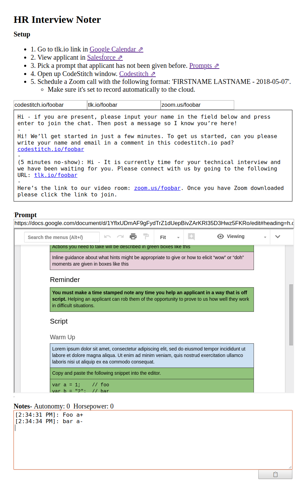

# Interview Noter

This application aids HR technical interviewers with note-taking and script-reading.

  

## Installation

After building the bundle you can simply open the index.html file, or serve the application with express.

### Opening the file
1. Clone the repo.
    * `git clone https://github.com/kguinto/interview-noter.git`
    * `cd interviewer-noter`

2. Run the install.
    * `npm i`

3. Build and start the application.
    * `npm start`

4. If the page isn't already open, you can find it at `/client/dist/index.html`

### Running the server

1. Clone the repo.
    * `git clone https://github.com/kguinto/interview-noter.git`
    * `cd interviewer-noter`

2. Run the install.
    * `npm i`

3. Build and start the application.
    * `npm run start-server`

4. Visit the page.
    * http://localhost:3033/