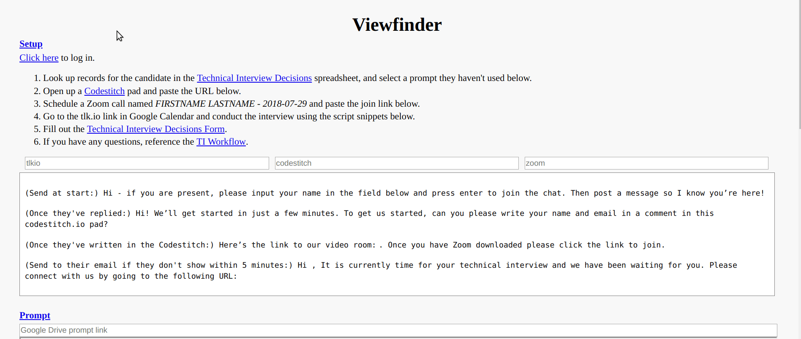

# Viewfinder

This app shortens and simplifies the setup for Hack Reactor technical admissions interviews. 
* Automatically pulls candidate information from interviewer's calendar
* Finds and displays results of previous interviews by candidate
* Generates fresh Codestitch pad
* Suggests prompt to use
* Creates copy of selected prompt in the correct month's folder, and displays it in the app, with one click

It makes it easier to conduct the interview, too! 
* Prepopulates script snippets with candidate's name and relevant URLs
* Makes it easy to take time-stamped notes, either by time of day or time since interview start
* Consolidates prompt document and notes into one window
* Keeps a running count of positive and negative notes on the candidate

  

## Installation

1. Clone the repo.
    * `git clone https://github.com/samliebow/viewfinder`
    * `cd viewfinder`

2. Run the install.
    * `npm i`

3. Add the configuration files `config.js` and `staticTiHistory.js` to the repo root.

## Use

1. Build the bundle, start the server, and launch the webpage.
    * `npm start`

2. If the page isn't already open, go to `http://lvh.me:3033`. `lvh.me` resolves to `127.0.0.1` (localhost); this app uses it because Google OAuth doesn't work normally without a domain name.

3. Log in with your Hack Reactor email.

4. Follow the instructions under 'Setup'.

## Acknowledgments

Viewfinder is an elaboration on Interview Noter by [Kirk Guinto](http://github.com/kguinto). Kirk came up with the idea of an app that would consolidate the interview materials, and wrote most of the code that doesn't have to do with API calls. I wouldn't even have gotten started working on this without him.

Interview Noter was in turn inspired by Autohorse by [James Jelenko](https://github.com/emp-norton), a tool for automatically timestamping and adding up notes which was the basis for the Notes component.